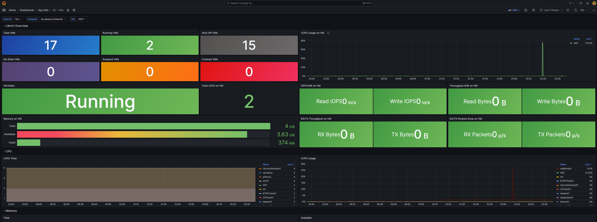
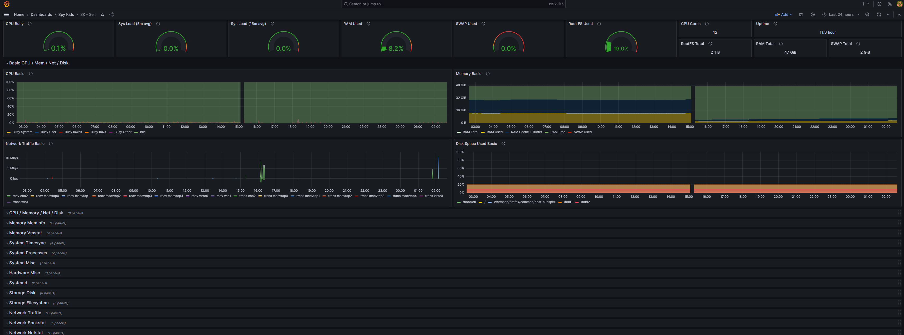
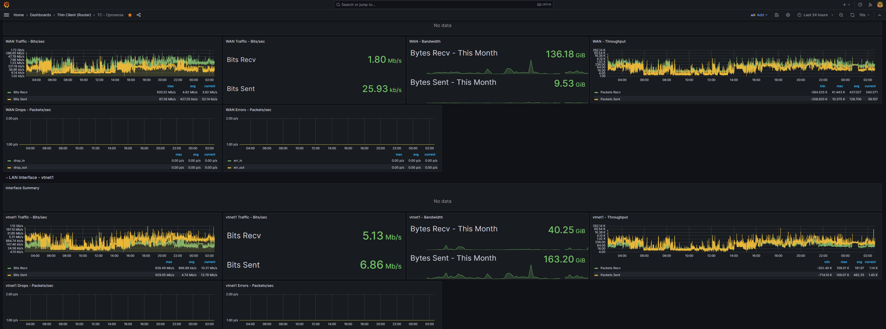
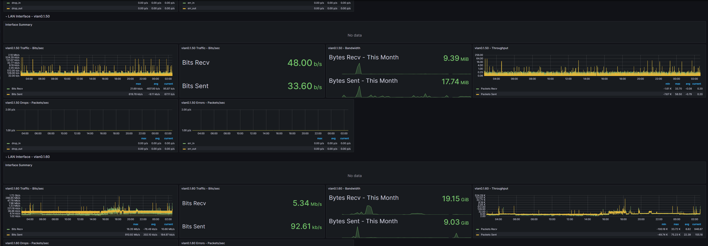
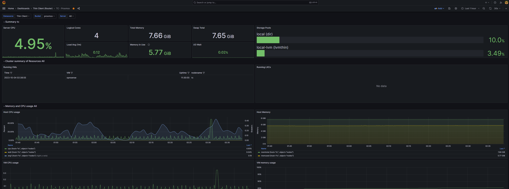

# My Homelab
I created this repository to store information on my homelab and most of my devices I use publicly. I also like having things documented publicly in the case I forget specs on certain devices, etc. and I can't access the device (e.g. I'm away from home).

I have a pretty big homelab consisting of three servers (one formerly my old gaming desktop technically).

## Servers
### One (Classic)
* 2 x [Intel Xeon L5640](https://ark.intel.com/content/www/us/en/ark/products/47926/intel-xeon-processor-l5640-12m-cache-2-26-ghz-5-86-gts-intel-qpi.html) @ 2.27 GHz (12 cores and 24 threads total)
* 32 GBs of DDR3 RAM
* 150 GBs HDD
* 300 GBs HDD
* 4 x 1 Gbps NIC
* IPMI & KVM Support

Runs **Proxmox** for VMs, VLANs, and more.

Output from `lshw -short`.

```
H/W path             Device     Class          Description
==========================================================
                                system         PowerEdge R610
/0                              bus            0F0XJ6
/0/0                            memory         64KiB BIOS
/0/400                          processor      Intel(R) Xeon(R) CPU           L5640  @ 2.27GHz
/0/400/700                      memory         192KiB L1 cache
/0/400/701                      memory         1536KiB L2 cache
/0/400/702                      memory         12MiB L3 cache
/0/401                          processor      Intel(R) Xeon(R) CPU           L5640  @ 2.27GHz
/0/401/703                      memory         192KiB L1 cache
/0/401/704                      memory         1536KiB L2 cache
/0/401/705                      memory         12MiB L3 cache
/0/1000                         memory         32GiB System Memory
/0/1000/0                       memory         4GiB DIMM DDR3 Synchronous Registered (Buffered) 1333 MHz (0.8 ns)
/0/1000/1                       memory         4GiB DIMM DDR3 Synchronous Registered (Buffered) 1333 MHz (0.8 ns)
/0/1000/2                       memory         DIMM DDR3 Synchronous [empty]
/0/1000/3                       memory         4GiB DIMM DDR3 Synchronous Registered (Buffered) 1333 MHz (0.8 ns)
/0/1000/4                       memory         4GiB DIMM DDR3 Synchronous Registered (Buffered) 1333 MHz (0.8 ns)
/0/1000/5                       memory         DIMM DDR3 Synchronous [empty]
/0/1000/6                       memory         4GiB DIMM DDR3 Synchronous Registered (Buffered) 1333 MHz (0.8 ns)
/0/1000/7                       memory         4GiB DIMM DDR3 Synchronous Registered (Buffered) 1333 MHz (0.8 ns)
/0/1000/8                       memory         DIMM DDR3 Synchronous [empty]
/0/1000/9                       memory         4GiB DIMM DDR3 Synchronous Registered (Buffered) 1333 MHz (0.8 ns)
/0/1000/a                       memory         4GiB DIMM DDR3 Synchronous Registered (Buffered) 1333 MHz (0.8 ns)
/0/1000/b                       memory         DIMM DDR3 Synchronous [empty]
/0/100                          bridge         5500 I/O Hub to ESI Port
/0/100/1                        bridge         5520/5500/X58 I/O Hub PCI Express Root Port 1
/0/100/1/0           eno1       network        NetXtreme II BCM5709 Gigabit Ethernet
/0/100/1/0.1         eno2       network        NetXtreme II BCM5709 Gigabit Ethernet
/0/100/3                        bridge         5520/5500/X58 I/O Hub PCI Express Root Port 3
/0/100/3/0           eno3       network        NetXtreme II BCM5709 Gigabit Ethernet
/0/100/3/0.1         eno4       network        NetXtreme II BCM5709 Gigabit Ethernet
/0/100/7                        bridge         5520/5500/X58 I/O Hub PCI Express Root Port 7
/0/100/9                        bridge         7500/5520/5500/X58 I/O Hub PCI Express Root Port 9
/0/100/14                       generic        7500/5520/5500/X58 I/O Hub System Management Registers
/0/100/14.1                     generic        7500/5520/5500/X58 I/O Hub GPIO and Scratch Pad Registers
/0/100/14.2                     generic        7500/5520/5500/X58 I/O Hub Control Status and RAS Registers
/0/100/1a                       bus            82801I (ICH9 Family) USB UHCI Controller #4
/0/100/1a/1          usb3       bus            UHCI Host Controller
/0/100/1a.1                     bus            82801I (ICH9 Family) USB UHCI Controller #5
/0/100/1a.1/1        usb4       bus            UHCI Host Controller
/0/100/1a.7                     bus            82801I (ICH9 Family) USB2 EHCI Controller #2
/0/100/1a.7/1        usb1       bus            EHCI Host Controller
/0/100/1a.7/1/3                 bus            USB 2.0 Hub
/0/100/1c                       bridge         82801I (ICH9 Family) PCI Express Port 1
/0/100/1c/0          scsi0      storage        MegaRAID SAS 2108 [Liberator]
/0/100/1c/0/2.0.0    /dev/sda   disk           146GB PERC H700
/0/100/1c/0/2.0.0/1  /dev/sda1  volume         1006KiB BIOS Boot partition
/0/100/1c/0/2.0.0/2  /dev/sda2  volume         511MiB Windows FAT volume
/0/100/1c/0/2.0.0/3  /dev/sda3  volume         135GiB LVM Physical Volume
/0/100/1c/0/2.1.0    /dev/sdb   volume         278GiB PERC H700
/0/100/1d                       bus            82801I (ICH9 Family) USB UHCI Controller #1
/0/100/1d/1          usb5       bus            UHCI Host Controller
/0/100/1d/1/2                   input          USB Composite Device-0
/0/100/1d.1                     bus            82801I (ICH9 Family) USB UHCI Controller #2
/0/100/1d.1/1        usb6       bus            UHCI Host Controller
/0/100/1d.7                     bus            82801I (ICH9 Family) USB2 EHCI Controller #1
/0/100/1d.7/1        usb2       bus            EHCI Host Controller
/0/100/1e                       bridge         82801 PCI Bridge
/0/100/1e/3                     display        MGA G200eW WPCM450
/0/100/1f                       bridge         82801IB (ICH9) LPC Interface Controller
/0/101                          bridge         Xeon 5600 Series QuickPath Architecture Generic Non-core Registers
/0/102                          bridge         Xeon 5600 Series QuickPath Architecture System Address Decoder
/0/103                          bridge         Xeon 5600 Series QPI Link 0
/0/104                          bridge         Xeon 5600 Series QPI Physical 0
/0/105                          bridge         Xeon 5600 Series Mirror Port Link 0
/0/106                          bridge         Xeon 5600 Series Mirror Port Link 1
/0/107                          bridge         Xeon 5600 Series QPI Link 1
/0/108                          bridge         Xeon 5600 Series QPI Physical 1
/0/109                          bridge         Xeon 5600 Series Integrated Memory Controller Registers
/0/10a                          bridge         Xeon 5600 Series Integrated Memory Controller Target Address Decoder
/0/10b                          bridge         Xeon 5600 Series Integrated Memory Controller RAS Registers
/0/10c                          bridge         Xeon 5600 Series Integrated Memory Controller Test Registers
/0/10d                          bridge         Xeon 5600 Series Integrated Memory Controller Channel 0 Control
/0/10e                          bridge         Xeon 5600 Series Integrated Memory Controller Channel 0 Address
/0/10f                          bridge         Xeon 5600 Series Integrated Memory Controller Channel 0 Rank
/0/110                          bridge         Xeon 5600 Series Integrated Memory Controller Channel 0 Thermal Control
/0/111                          bridge         Xeon 5600 Series Integrated Memory Controller Channel 1 Control
/0/112                          bridge         Xeon 5600 Series Integrated Memory Controller Channel 1 Address
/0/113                          bridge         Xeon 5600 Series Integrated Memory Controller Channel 1 Rank
/0/114                          bridge         Xeon 5600 Series Integrated Memory Controller Channel 1 Thermal Control
/0/115                          bridge         Xeon 5600 Series Integrated Memory Controller Channel 2 Control
/0/116                          bridge         Xeon 5600 Series Integrated Memory Controller Channel 2 Address
/0/117                          bridge         Xeon 5600 Series Integrated Memory Controller Channel 2 Rank
/0/118                          bridge         Xeon 5600 Series Integrated Memory Controller Channel 2 Thermal Control
/0/119                          bridge         Xeon 5600 Series QuickPath Architecture Generic Non-core Registers
/0/11a                          bridge         Xeon 5600 Series QuickPath Architecture System Address Decoder
/0/11b                          bridge         Xeon 5600 Series QPI Link 0
/0/11c                          bridge         Xeon 5600 Series QPI Physical 0
/0/11d                          bridge         Xeon 5600 Series Mirror Port Link 0
/0/11e                          bridge         Xeon 5600 Series Mirror Port Link 1
/0/11f                          bridge         Xeon 5600 Series QPI Link 1
/0/120                          bridge         Xeon 5600 Series QPI Physical 1
/0/121                          bridge         Xeon 5600 Series Integrated Memory Controller Registers
/0/122                          bridge         Xeon 5600 Series Integrated Memory Controller Target Address Decoder
/0/123                          bridge         Xeon 5600 Series Integrated Memory Controller RAS Registers
/0/124                          bridge         Xeon 5600 Series Integrated Memory Controller Test Registers
/0/125                          bridge         Xeon 5600 Series Integrated Memory Controller Channel 0 Control
/0/126                          bridge         Xeon 5600 Series Integrated Memory Controller Channel 0 Address
/0/127                          bridge         Xeon 5600 Series Integrated Memory Controller Channel 0 Rank
/0/128                          bridge         Xeon 5600 Series Integrated Memory Controller Channel 0 Thermal Control
/0/129                          bridge         Xeon 5600 Series Integrated Memory Controller Channel 1 Control
/0/12a                          bridge         Xeon 5600 Series Integrated Memory Controller Channel 1 Address
/0/12b                          bridge         Xeon 5600 Series Integrated Memory Controller Channel 1 Rank
/0/12c                          bridge         Xeon 5600 Series Integrated Memory Controller Channel 1 Thermal Control
/0/12d                          bridge         Xeon 5600 Series Integrated Memory Controller Channel 2 Control
/0/12e                          bridge         Xeon 5600 Series Integrated Memory Controller Channel 2 Address
/0/12f                          bridge         Xeon 5600 Series Integrated Memory Controller Channel 2 Rank
/0/130                          bridge         Xeon 5600 Series Integrated Memory Controller Channel 2 Thermal Control
/0/1                            system         PnP device PNP0c01
/0/2                            system         PnP device PNP0b00
/0/3                            communication  PnP device PNP0501
/0/4                            communication  PnP device PNP0501
/0/5                            system         PnP device PNP0c01
/0/6                            generic        PnP device IPI0001
/0/7                            system         PnP device PNP0c02
/0/8                            system         PnP device PNP0c02
/1                   tap101i0   network        Ethernet interface
/2                   vmbr0      network        Ethernet interface
/3                   tap100i0   network        Ethernet interface
/4                   fwbr106i0  network        Ethernet interface
/5                   fwln106i0  network        Ethernet interface
/6                   tap106i0   network        Ethernet interface
/7                   tap100i1   network        Ethernet interface
/8                   fwpr106p0  network        Ethernet interface
```

### Two (PowerBall)
* [AMD Ryzen 5 3600](https://www.amd.com/en/product/8456) @ 3.6 GHz (6 cores and 12 threads)
* 32 GBs of DDR4 RAM
* 1 TB SSD
* 2 TBs HDD
* 8 TBs External HDD drive
* 1 Gbps NIC
* 10 Gbps NIC - **Not Attached**

Runs **Ubuntu 20.04** with KVM and QEMU for VMs, VLANs, and more.

Output from `lshw -short`.

```
H/W path            Device      Class          Description
==========================================================
                                system         To Be Filled By O.E.M. (To Be Filled By O.E.M.)
/0                              bus            B450M Pro4
/0/0                            memory         64KiB BIOS
/0/c                            memory         32GiB System Memory
/0/c/0                          memory         [empty]
/0/c/1                          memory         16GiB DIMM DDR4 Synchronous Unbuffered (Unregistered) 2133 M
/0/c/2                          memory         [empty]
/0/c/3                          memory         16GiB DIMM DDR4 Synchronous Unbuffered (Unregistered) 2133 M
/0/f                            memory         384KiB L1 cache
/0/10                           memory         3MiB L2 cache
/0/11                           memory         32MiB L3 cache
/0/12                           processor      AMD Ryzen 5 3600 6-Core Processor
/0/100                          bridge         Starship/Matisse Root Complex
/0/100/1.3                      bridge         Starship/Matisse GPP Bridge
/0/100/1.3/0                    bus            400 Series Chipset USB 3.1 XHCI Controller
/0/100/1.3/0/0      usb1        bus            xHCI Host Controller
/0/100/1.3/0/1      usb2        bus            xHCI Host Controller
/0/100/1.3/0.1                  storage        400 Series Chipset SATA Controller
/0/100/1.3/0.2                  bridge         400 Series Chipset PCIe Bridge
/0/100/1.3/0.2/0                bridge         400 Series Chipset PCIe Port
/0/100/1.3/0.2/1                bridge         400 Series Chipset PCIe Port
/0/100/1.3/0.2/1/0  enp4s0      network        RTL8111/8168/8411 PCI Express Gigabit Ethernet Controller
/0/100/1.3/0.2/4                bridge         400 Series Chipset PCIe Port
/0/100/7.1                      bridge         Starship/Matisse Internal PCIe GPP Bridge 0 to bus[E:B]
/0/100/7.1/0                    generic        Starship/Matisse PCIe Dummy Function
/0/100/8.1                      bridge         Starship/Matisse Internal PCIe GPP Bridge 0 to bus[E:B]
/0/100/8.1/0                    generic        Starship/Matisse Reserved SPP
/0/100/8.1/0.1                  generic        Starship/Matisse Cryptographic Coprocessor PSPCPP
/0/100/8.1/0.3                  bus            Matisse USB 3.0 Host Controller
/0/100/8.1/0.3/0    usb3        bus            xHCI Host Controller
/0/100/8.1/0.3/1    usb4        bus            xHCI Host Controller
/0/100/8.1/0.3/1/1              storage        Avolusion PRO-5Y
/0/100/8.1/0.4                  multimedia     Starship/Matisse HD Audio Controller
/0/100/8.2                      bridge         Starship/Matisse Internal PCIe GPP Bridge 0 to bus[E:B]
/0/100/8.2/0                    storage        FCH SATA Controller [AHCI mode]
/0/100/8.3                      bridge         Starship/Matisse Internal PCIe GPP Bridge 0 to bus[E:B]
/0/100/8.3/0                    storage        FCH SATA Controller [AHCI mode]
/0/100/14                       bus            FCH SMBus Controller
/0/100/14.3                     bridge         FCH LPC Bridge
/0/101                          bridge         Starship/Matisse PCIe Dummy Host Bridge
/0/102                          bridge         Starship/Matisse PCIe Dummy Host Bridge
/0/103                          bridge         Starship/Matisse PCIe Dummy Host Bridge
/0/104                          bridge         Starship/Matisse PCIe Dummy Host Bridge
/0/105                          bridge         Starship/Matisse PCIe Dummy Host Bridge
/0/106                          bridge         Starship/Matisse PCIe Dummy Host Bridge
/0/107                          bridge         Starship/Matisse PCIe Dummy Host Bridge
/0/108                          bridge         Matisse Device 24: Function 0
/0/109                          bridge         Matisse Device 24: Function 1
/0/10a                          bridge         Matisse Device 24: Function 2
/0/10b                          bridge         Matisse Device 24: Function 3
/0/10c                          bridge         Matisse Device 24: Function 4
/0/10d                          bridge         Matisse Device 24: Function 5
/0/10e                          bridge         Matisse Device 24: Function 6
/0/10f                          bridge         Matisse Device 24: Function 7
/0/1                            system         PnP device PNP0c01
/0/2                            system         PnP device PNP0c02
/0/3                            system         PnP device PNP0c02
/0/4                            system         PnP device PNP0b00
/0/5                            system         PnP device PNP0c02
/0/6                            communication  PnP device PNP0501
/0/7                            system         PnP device PNP0c02
/0/8                scsi0       storage
/0/8/0.0.0          /dev/sda    disk           1TB Samsung SSD 860
/0/8/0.0.0/1        /dev/sda1   volume         1023KiB BIOS Boot partition
/0/8/0.0.0/2        /dev/sda2   volume         1GiB EXT4 volume
/0/8/0.0.0/3        /dev/sda3   volume         930GiB EFI partition
/0/9                scsi4       storage
/0/9/0.0.0          /dev/sdb    volume         1863GiB ST2000DM008-2FR1
/0/a                scsi10      storage
/0/a/0.0.0          /dev/sdc    disk           8001GB Avolusion PRO-5Y
/0/a/0.0.0/1        /dev/sdc1   volume         7452GiB EXT4 volume
/1                  macvtap5    network        Ethernet interface
/2                  macvtap3    network        Ethernet interface
/3                  vnet0       network        Ethernet interface
/4                  macvtap1    network        Ethernet interface
/5                  macvtap4    network        Ethernet interface
/6                  macvtap2    network        Ethernet interface
/7                  macvtap0    network        Ethernet interface
/8                  virbr0-nic  network        Ethernet interface
/9                  macvtap6    network        Ethernet interface

```

### Three (SpyKids)
* [Intel i7-8700K](https://www.intel.com/content/www/us/en/products/sku/126684/intel-core-i78700k-processor-12m-cache-up-to-4-70-ghz/specifications.html) @ 3.7 GHz (6 cores and 12 threads)
* RTX 2070 GPU
* 48 GBs of DDR4 RAM (2 x 16 GBs and 2 x 8 GBs)
* 2 TBs SSD
* 2 x 3 TBs HDD
* 1 Gbps NIC

Runs **Ubuntu 22.04** with KVM and QEMU for VMs, VLANs, and more.

Output from `lshw -short`.

```
H/W path           Device     Class          Description
========================================================
                              system         System Product Name (ASUS_MB_CNL)
/0                            bus            ROG STRIX Z390-E GAMING
/0/0                          memory         64KiB BIOS
/0/49                         memory         48GiB System Memory
/0/49/0                       memory         8GiB DIMM DDR4 Synchronous 3000 MHz (0.3 ns)
/0/49/1                       memory         16GiB DIMM DDR4 Synchronous 3000 MHz (0.3 ns)
/0/49/2                       memory         8GiB DIMM DDR4 Synchronous 3000 MHz (0.3 ns)
/0/49/3                       memory         16GiB DIMM DDR4 Synchronous 3000 MHz (0.3 ns)
/0/54                         memory         384KiB L1 cache
/0/55                         memory         1536KiB L2 cache
/0/56                         memory         12MiB L3 cache
/0/57                         processor      Intel(R) Core(TM) i7-8700K CPU @ 3.70GHz
/0/100                        bridge         8th Gen Core Processor Host Bridge/DRAM Registers
/0/100/1                      bridge         6th-10th Gen Core Processor PCIe Controller (x16)
/0/100/1.1                    bridge         Xeon E3-1200 v5/E3-1500 v5/6th Gen Core Processor PCIe Control
/0/100/1.1/0       /dev/fb0   display        TU106 [GeForce RTX 2070]
/0/100/1.1/0.1     card1      multimedia     TU106 High Definition Audio Controller
/0/100/1.1/0.1/0   input11    input          HDA NVidia HDMI/DP,pcm=3
/0/100/1.1/0.1/1   input12    input          HDA NVidia HDMI/DP,pcm=7
/0/100/1.1/0.1/2   input13    input          HDA NVidia HDMI/DP,pcm=8
/0/100/1.1/0.1/3   input14    input          HDA NVidia HDMI/DP,pcm=9
/0/100/1.1/0.1/4   input15    input          HDA NVidia HDMI/DP,pcm=10
/0/100/1.1/0.1/5   input16    input          HDA NVidia HDMI/DP,pcm=11
/0/100/1.1/0.1/6   input17    input          HDA NVidia HDMI/DP,pcm=12
/0/100/1.1/0.2                bus            TU106 USB 3.1 Host Controller
/0/100/1.1/0.2/0   usb3       bus            xHCI Host Controller
/0/100/1.1/0.2/1   usb4       bus            xHCI Host Controller
/0/100/1.1/0.3                bus            TU106 USB Type-C UCSI Controller
/0/100/14                     bus            Cannon Lake PCH USB 3.1 xHCI Host Controller
/0/100/14/0        usb1       bus            xHCI Host Controller
/0/100/14/0/6                 bus            USB2.0 Hub
/0/100/14/0/6/4               input          AURA MOTHERBOARD
/0/100/14/0/e                 communication  Bluetooth 9460/9560 Jefferson Peak (JfP)
/0/100/14/1        usb2       bus            xHCI Host Controller
/0/100/14.2                   memory         RAM memory
/0/100/14.3        wlo1       network        Cannon Lake PCH CNVi WiFi
/0/100/16                     communication  Cannon Lake PCH HECI Controller
/0/100/17          scsi0      storage        SATA Controller [RAID mode]
/0/100/17/0        /dev/sda   disk           2TB Samsung SSD 860
/0/100/17/0/1      /dev/sda1  volume         511MiB Windows FAT volume
/0/100/17/0/2      /dev/sda2  volume         1862GiB EXT4 volume
/0/100/17/1        /dev/sdb   disk           3TB ST3000DM008-2DM1
/0/100/17/1/1      /dev/sdb1  volume         2794GiB EXT4 volume
/0/100/17/0.0.0    /dev/sdc   disk           3TB ST3000DM008-2DM1
/0/100/17/0.0.0/1  /dev/sdc1  volume         2794GiB EXT4 volume
/0/100/1b                     bridge         Cannon Lake PCH PCI Express Root Port #17
/0/100/1c                     bridge         Cannon Lake PCH PCI Express Root Port #1
/0/100/1d                     bridge         Cannon Lake PCH PCI Express Root Port #9
/0/100/1f                     bridge         Z390 Chipset LPC/eSPI Controller
/0/100/1f/0                   system         PnP device PNP0c02
/0/100/1f/1                   system         PnP device PNP0c02
/0/100/1f/2                   communication  PnP device PNP0501
/0/100/1f/3                   system         PnP device PNP0c02
/0/100/1f/4                   generic        PnP device INT3f0d
/0/100/1f/5                   system         PnP device PNP0c02
/0/100/1f/6                   system         PnP device PNP0c02
/0/100/1f/7                   system         PnP device PNP0c02
/0/100/1f/8                   system         PnP device PNP0c02
/0/100/1f.3        card0      multimedia     Cannon Lake PCH cAVS
/0/100/1f.3/0      input18    input          HDA Intel PCH Front Mic
/0/100/1f.3/1      input19    input          HDA Intel PCH Rear Mic
/0/100/1f.3/2      input20    input          HDA Intel PCH Line
/0/100/1f.3/3      input21    input          HDA Intel PCH Line Out Front
/0/100/1f.3/4      input22    input          HDA Intel PCH Line Out Surround
/0/100/1f.3/5      input23    input          HDA Intel PCH Line Out CLFE
/0/100/1f.3/6      input24    input          HDA Intel PCH Front Headphone
/0/100/1f.4                   bus            Cannon Lake PCH SMBus Controller
/0/100/1f.5                   bus            Cannon Lake PCH SPI Controller
/0/100/1f.6        eno2       network        Ethernet Connection (7) I219-V
/1                            power          To Be Filled By O.E.M.
/2                 input0     input          Sleep Button
/3                 input1     input          Power Button
/4                 input10    input          Eee PC WMI hotkeys
/5                 input2     input          Power Button
```

## Raspberry Pis
I have three [Raspberry Pi Model B](https://www.amazon.com/Raspberry-Model-2019-Quad-Bluetooth/dp/B07TC2BK1X) units that I like experimenting with. I've also purchased a sensor kit for these Raspberry Pi units and hope to create a weather station with them at some point in the future!

## Statistics
I have a [Grafana](https://grafana.com/) server listening on a VM on one of my home servers with InfluxDB and Prometheus as data sources. The Grafana VM's main OS is installed onto an SSD, but the data from Prometheus and InfluxDB are stored on an HDD due to having a lot more space.

All of my home servers, VMs, routers, and networks report statistics to the Grafana server as seen below!







## Network
### Router
Around late September of 2023, I decided to purchase an [HP EliteDesk 800 Thin Client](https://www.amazon.com/dp/B07Q1DL6LV) and install Proxmox onto the host with a VM created with [OPNsense](https://opnsense.org/) installed to act as my main router. Unfortunately, USB to Ethernet drivers are very inefficient in OPNsense/FreeBSD (very slow speeds, in my case) which is why I ended up virtualizing the router via [Proxmox](https://www.proxmox.com/en/), KVM, and QEMU. I've attached two [TP-Link USB To Ethernet](https://www.amazon.com/dp/B09GRL3VCN) adapters to the server so that I have a total of three NICs to utilize. The on-board NIC is assigned to WAN while one of the USB to Ethernet adapters is used for LAN. The last USB to Ethernet adapter is used for management. I've configured multiple VLANs for my home servers, WiFi, and more. I've also setup logging and statistics to a Grafana server I have hosted on a VM on one of my home servers.

I also understand using USB to Ethernet adapters isn't recommended, but I haven't had any issues with them speed-wise and they are capable of achieving gigabit speeds which is the most I really need in my LAN environment.

Here's the output from `lshw -short` on the Proxmox host.

```
root@tc:~# lshw -short
H/W path             Device           Class          Description
================================================================
                                      system         HP EliteDesk 800 G1 DM (K8S70UC#ABA)
/0                                    bus            1825
/0/0                                  memory         64KiB BIOS
/0/9                                  processor      Intel(R) Core(TM) i5-4590T CPU @ 2.00GHz
/0/9/a                                memory         1MiB L2 cache
/0/9/b                                memory         256KiB L1 cache
/0/9/c                                memory         6MiB L3 cache
/0/d                                  memory         8GiB System Memory
/0/d/0                                memory         4GiB SODIMM DDR3 Synchronous 1600 MHz (0.6 ns)
/0/d/1                                memory         4GiB SODIMM DDR3 Synchronous 1600 MHz (0.6 ns)
/0/100                                bridge         4th Gen Core Processor DRAM Controller
/0/100/2             /dev/fb0         display        Xeon E3-1200 v3/4th Gen Core Processor Integrated Grap
/0/100/3             card0            multimedia     Xeon E3-1200 v3/4th Gen Core Processor HD Audio Contro
/0/100/3/0           input10          input          HDA Intel HDMI HDMI/DP,pcm=3
/0/100/3/1           input11          input          HDA Intel HDMI HDMI/DP,pcm=7
/0/100/3/2           input12          input          HDA Intel HDMI HDMI/DP,pcm=8
/0/100/14                             bus            8 Series/C220 Series Chipset Family USB xHCI
/0/100/14/0          usb3             bus            xHCI Host Controller
/0/100/14/1          usb4             bus            xHCI Host Controller
/0/100/14/1/1                         generic        AX88179
/0/100/14/1/3                         generic        AX88179
/0/100/16                             communication  8 Series/C220 Series Chipset Family MEI Controller #1
/0/100/16.3                           communication  8 Series/C220 Series Chipset Family KT Controller
/0/100/19            eno1             network        Ethernet Connection I217-LM
/0/100/1a                             bus            8 Series/C220 Series Chipset Family USB EHCI #2
/0/100/1a/1          usb1             bus            EHCI Host Controller
/0/100/1a/1/1                         bus            Integrated Rate Matching Hub
/0/100/1b            card1            multimedia     8 Series/C220 Series Chipset High Definition Audio Con
/0/100/1b/0          input7           input          HDA Intel PCH Mic
/0/100/1b/1          input8           input          HDA Intel PCH Line Out
/0/100/1b/2          input9           input          HDA Intel PCH Front Headphone
/0/100/1d                             bus            8 Series/C220 Series Chipset Family USB EHCI #1
/0/100/1d/1          usb2             bus            EHCI Host Controller
/0/100/1d/1/1                         bus            Integrated Rate Matching Hub
/0/100/1f                             bridge         Q87 Express LPC Controller
/0/100/1f/0                           system         PnP device PNP0c01
/0/100/1f/1                           system         PnP device PNP0c02
/0/100/1f/2                           system         PnP device PNP0b00
/0/100/1f/3                           generic        PnP device INT3f0d
/0/100/1f/4                           system         PnP device PNP0c02
/0/100/1f/5                           input          PnP device PNP0303
/0/100/1f/6                           input          PnP device PNP0f03
/0/100/1f/7                           system         PnP device PNP0c02
/0/100/1f/8                           generic        PnP device IFX0102
/0/100/1f/9                           system         PnP device PNP0c02
/0/100/1f.2          scsi0            storage        8 Series/C220 Series Chipset Family 6-port SATA Contro
/0/100/1f.2/0.0.0    /dev/sda         disk           256GB KingFast
/0/100/1f.2/0.0.0/1  /dev/sda1        volume         1006KiB BIOS Boot partition
/0/100/1f.2/0.0.0/2  /dev/sda2        volume         1023MiB Windows FAT volume
/0/100/1f.2/0.0.0/3  /dev/sda3        volume         237GiB LVM Physical Volume
/0/100/1f.3                           bus            8 Series/C220 Series Chipset Family SMBus Controller
/1                                    power          High Efficiency
/2                   input0           input          Power Button
/3                   input1           input          Power Button
/4                   input5           input          PC Speaker
/5                   input6           input          HP WMI hotkeys
/6                   enx7cc2c6496f11  network        Ethernet interface
/7                   enx7cc2c6496f15  network        Ethernet interface
```

### Switch
I have an EdgeSwitch8 that all servers go through which handles VLAN tagging and untagging.

### WiFi
I have a 2.4 GHz and 5 GHz WiFi router that acts as an access point, but has the option for creating your own LAN.

## My Desktop
I have a powerful gaming desktop that I use as my main PC, development work, and general use such as gaming. I have Windows 11 installed, and I use VS Code and its Remote extension for developing projects on my home servers in VMs running Linux.

* [AMD Ryzen 9 5900X](https://www.amd.com/en/products/cpu/amd-ryzen-9-5900x) @ 3.7 GHz (12 cores and 24 threads)
* RTX 3090 TI
* 64 GBs of DDR4 RAM
* 2 x 2 TBs NVMe SSDs
* 1 Gbps NIC

## My Laptop
I have an [ASUS TUF Gaming A17](https://www.amazon.com/ASUS-IPS-Type-GeForce-Battery-TUF706IU-AS76/dp/B0863DFMV7) laptop with Ubuntu 22.04 installed that I use for development work and general use. I don't do much gaming on it unless I'm away from my home, but it handles most games just fine!

## Old Hardware
### Router
I had an EdgeRouter X running EdgeOS software. I had each home server and WiFi on their own `/24` VLANs and still do on the newer router.

**This router bricked after attempting a firmware upgrade. It was replaced with the router mentioned above.**
